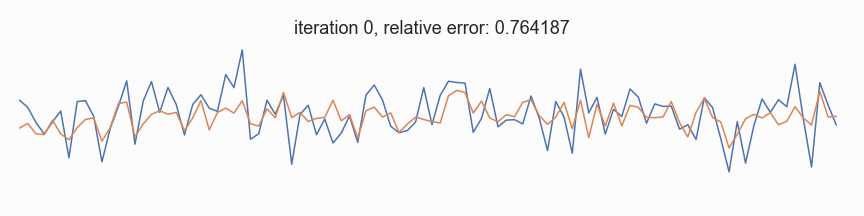

.. operon documentation master file, created by
   sphinx-quickstart on Sun Apr 19 16:39:36 2020.
   You can adapt this file completely to your liking, but it should at least
   contain the root `toctree` directive.
.. note::
    **The documentation is under construction.**

Introduction
============

*Operon* is a modern C++ framework for `symbolic regression <https://en.wikipedia.org/wiki/Symbolic_regression>`_ that uses `genetic programming <https://en.wikipedia.org/wiki/Genetic_programming>`_ to explore a hypothesis space of possible mathematical expressions in order to find the best-fitting model for a given `regression target <https://en.wikipedia.org/wiki/Regression_analysis>`_.
Its main purpose is to help develop accurate and interpretable white-box models in areas such as `system identification <https://en.wikipedia.org/wiki/System_identification>`_.

Motivation
----------

*Operon* was motivated by the need to have a *flexible* and *performant* system that *works out of the box*. Thus, it was developed with the following goals in mind:

Modern concurrency model
    Traditional threading approaches are not optimal for today's many-core systems. This means designing the evolutionary main loop in such a way as to avoid synchronisation overhead and take advantage of C++17's `execution policies`_.

Performance
    By using an efficient linear tree representation where each ``Node`` is `trivial`_ and vectorized evaluation with the help of the `Eigen <https://eigen.tuxfamily.org/>`_ library. The encoding consumes 40 bytes per tree node, allowing practitioners to work with very large populations.

Ease-of-use
    *Operon* (the core library) comes with a command-line client that just works: you pass it a dataset and it will start optimizing. Its behavior can be configured by command line options, making it easy to integrate with any scripting environment or high-level language such as Python. A Python script is provided for performing experiments automatically aggregating the results.

    For more advanced use cases, we provide a C++ and a Python API, briefly illustrated with some `examples <https://github.com/foolnotion/operon/tree/master/examples>`_.

For an overview of *Operon* please have a look at the :doc:`features` page.

The software was also presented at GECCO'2020 *EvoSoft* workshop: https://dl.acm.org/doi/10.1145/3377929.3398099. If you want to reference it in your publication, please use:

Reference
^^^^^^^^^

.. code-block:: tex

    @inproceedings{Burlacu:2020:GECCOcomp,
    author = {Bogdan Burlacu and Gabriel Kronberger and Michael Kommenda},
    title = {Operon C++: An Efficient Genetic Programming Framework for Symbolic Regression},
    year = {2020},
      editor = {Richard Allmendinger and others},
      isbn13 = {9781450371278},
    publisher = {Association for Computing Machinery},
      publisher_address = {New York, NY, USA},
    url = {https://doi.org/10.1145/3377929.3398099},
    doi = {doi:10.1145/3377929.3398099},
    booktitle = {Proceedings of the 2020 Genetic and Evolutionary Computation Conference Companion},
    pages = {1562–1570},
      size = {9 pages},
      keywords = {genetic algorithms, genetic programming, C++, symbolic regression},
      address = {internet},
    series = {GECCO '20},
      month = {July 8-12},
      organisation = {SIGEVO},
      abstract = {},
      notes = {Also known as \cite{10.1145/3377929.3398099}
               GECCO-2020
               A Recombination of the 29th International Conference on Genetic Algorithms (ICGA) and the 25th Annual Genetic Programming Conference (GP)},
    }

.. .. toctree::
..     :maxdepth: 0
..     :caption: Contents:
..
..     features
..     ...
..
.. Indices and tables
.. ==================
..
.. * :ref:`genindex`
.. * :ref:`modindex`
.. * :ref:`search`

.. toctree::
    :maxdepth: 0

    self

    features
    build
    example

.. _`symbolic regression`: https://en.wikipedia.org/wiki/Symbolic_regression
.. _`genetic programming`: https://en.wikipedia.org/wiki/Genetic_programming
.. _`execution policies`: https://www.bfilipek.com/2018/11/parallel-alg-perf.html
.. _`trivial`: https://en.cppreference.com/w/cpp/named_req/TrivialType
.. _'Eigen`: http://eigen.tuxfamily.org/index.php?title=Main_Page
